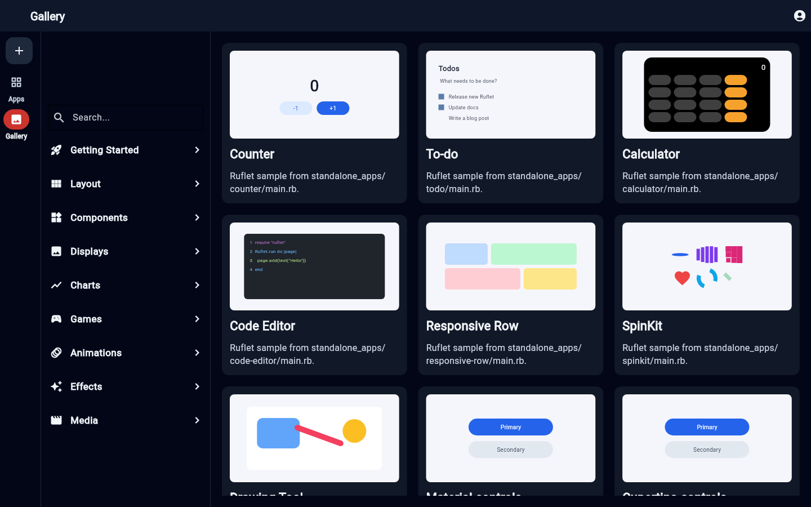
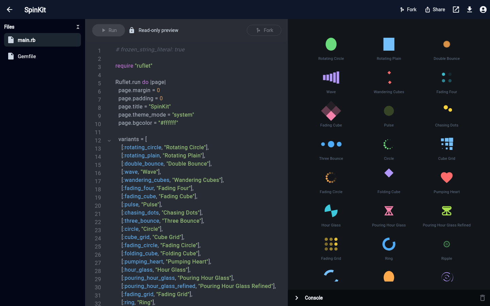
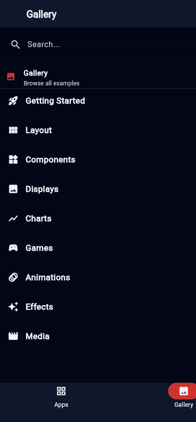
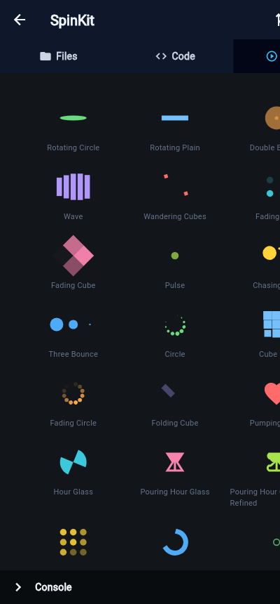

# Ruflet Studio

**Ruflet Studio is built with [Ruflet](https://github.com/AdamMusa/ruflet) and written 100% in pure Ruby — no Dart, no JavaScript, no Python.**

It's a Ruflet-native take on Flet Studio: an Apps grid, a browsable example **Gallery**, a live code editor with an instant preview pane, a console bar, sign-in dialog, and settings — all driven by a single Ruby codebase that runs natively on iOS, Android, desktop, and the web.

> Every screen, control, animation, and the 30+ loading spinners below are described in Ruby. Ruflet renders them through a Flutter client, so the same `main.rb` ships everywhere.

## Screenshots

### Desktop

The Gallery — categories on the left, live example cards on the right:



The example editor — read/edit the Ruby source on the left, see the live Ruflet preview on the right (here: all 30 `flet_spinkit` indicators, 3 per row):



### Mobile

The same app, responsive on a phone — category list and the SpinKit preview:

| Gallery | SpinKit preview |
| --- | --- |
|  |  |

## Why it matters

- **100% Ruby.** The UI is plain Ruby (`text`, `column`, `container`, `spinkit(...)`, …). No FFI, no templating, no client code to maintain.
- **One codebase, every platform.** `ruflet run` for instant dev, `ruflet build` for self-contained iOS/Android/macOS/Windows/Linux/web apps.
- **Live preview + best-effort hot reload.** Edit an example's source and hit **Run**; the preview re-renders and carries over mutated state (e.g. a counter keeps its value across edits).

## Requirements

- Ruby 3.x and Bundler
- The [Ruflet](https://github.com/AdamMusa/ruflet) toolchain (`ruflet` CLI). For device/desktop/web builds you also need the Flutter SDK and the relevant platform tools (Xcode for iOS, Android SDK for Android).

## Setup

```bash
bundle install
```

## Run (development)

The fastest loop. Starts the Ruflet backend and shows a QR code / URL to open in a Ruflet client:

```bash
ruflet run main            # mobile (scan the QR from the Ruflet client app)
ruflet run --web main      # open in a browser
ruflet run --desktop main  # native desktop window
```

## Build self-contained apps

Bundles the Ruby app + runtime into a standalone native app (no server needed):

```bash
ruflet build ios --self
ruflet build apk --self
ruflet build macos --self
ruflet build web            # served by the Ruby backend
```

Install a built app on a connected device:

```bash
ruflet install -d <device-id>
```

## How it's organized

```
ruflet_studio/
├── main.rb               # App shell: routing, Apps grid, Gallery, editor, settings
├── gallery_sections.rb   # Showcase sections + live component builders
├── ruflet.yaml           # App metadata + Flutter extensions to bundle
├── services.yaml         # Protected device permissions (camera, microphone, …)
└── standalone_apps/      # One folder per example — each a runnable Ruflet app
    ├── counter/main.rb
    ├── calculator/main.rb
    ├── spinkit/main.rb
    └── …
```

The **Gallery** sidebar groups examples into categories: *Getting Started, Layout,
Components, Displays, Charts, Games, Animations, Effects, Media*. The **Components**
category holds individual control demos (Text, Button, Container, TextField, SpinKit,
Material/Cupertino controls, …).

## Add your own example

1. Create a folder under `standalone_apps/`, e.g. `standalone_apps/my-demo/`.
2. Add a `main.rb`:

   ```ruby
   # frozen_string_literal: true
   require "ruflet"

   Ruflet.run do |page|
     page.margin = 0
     page.padding = 0
     page.title = "My Demo"
     page.add(
       container(
         expand: true,
         alignment: "center",
         content: text("Hello from pure Ruby!", style: { size: 24, weight: "w700" })
       )
     )
   end
   ```

3. Add a `Gemfile`:

   ```ruby
   source "https://rubygems.org"

   gem "ruflet_core", ">= 0.0.15"
   gem "ruflet_server", ">= 0.0.15"
   ```

4. Register it in `main.rb`'s `SHOWCASE_ROUTES` (slug, title, category, builder) so it
   shows up as a card in the Gallery.

## A taste of the API

```ruby
# A counter, entirely in Ruby
Ruflet.run do |page|
  count = 0
  label = text(count.to_s, style: { size: 40 })
  page.add(
    column(horizontal_alignment: "center", children: [
      label,
      filled_button(content: text("+1"),
                    on_click: ->(_e) { count += 1; page.update(label, value: count.to_s) })
    ])
  )
end

# A loading spinner from the flet_spinkit extension
spinkit(wave: { color: "#74c0fc", size: 48, item_count: 6 })
```

## License

See repository.

---

Built with ❤️ and pure Ruby on [Ruflet](https://github.com/AdamMusa/ruflet).
